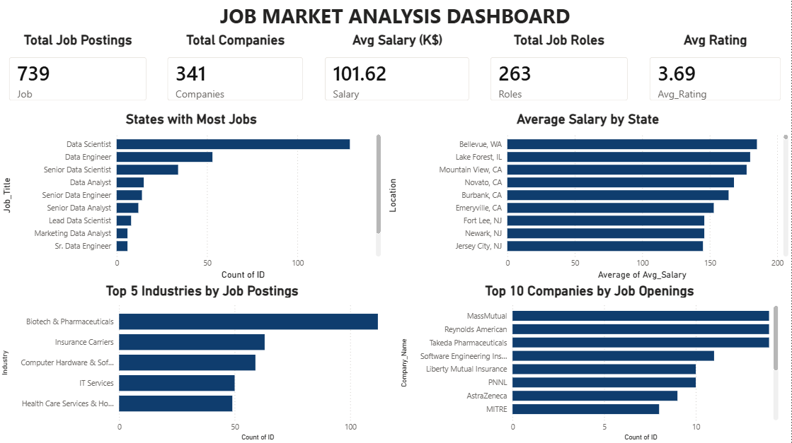
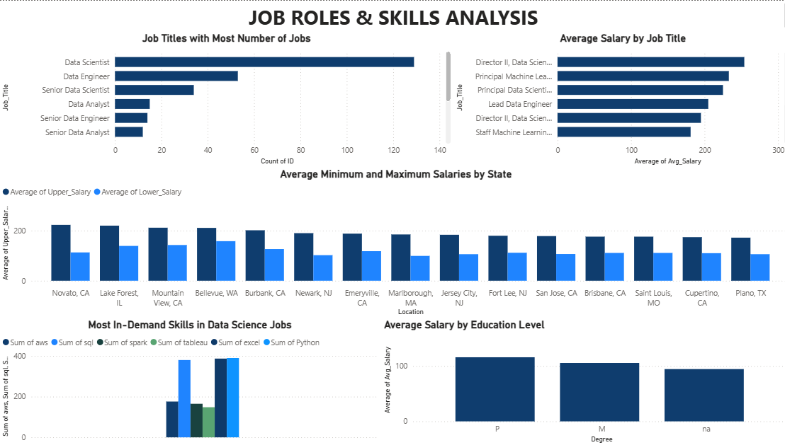

# Job Market Analysis Dashboard 📊

## Project Overview
An interactive 2-page Job Market Analysis Dashboard built using Power BI to analyze Data Science job postings, salary trends, hiring demand, required skills, and educational qualifications.

## Tools Used
- Power BI (Dashboard & Visualizations)
- SQL (Data Source)
- Microsoft Excel (Dataset)

## Dataset
- Total Records: 739 Job Postings
- Key Columns: Job Title, Company Name, Industry, Location, Salary Estimate, Lower Salary, Upper Salary, Avg Salary, Degree, Rating, Python, SQL, Excel, AWS, Spark, Tableau

## Dashboard Pages

### Page 1 — Job Market Analysis Dashboard
- KPI Cards: Total Job Postings (739), Total Companies (341), Avg Salary $101.62K, Total Job Roles (263), Avg Rating (3.69)
- Bar Chart: States with Most Jobs
- Bar Chart: Average Salary by State
- Bar Chart: Top 5 Industries by Job Postings
- Bar Chart: Top 10 Companies by Job Openings

### Page 2 — Job Roles & Skills Analysis
- Bar Chart: Job Titles with Most Number of Jobs
- Bar Chart: Average Salary by Job Title
- Clustered Bar Chart: Average Min and Max Salaries by State
- Bar Chart: Most In-Demand Skills in Data Science Jobs
- Bar Chart: Average Salary by Education Level

## Key Insights
- Data Scientist is the most in-demand job role with 130+ postings
- Bellevue, WA offers the highest average salary among all states
- Biotech & Pharmaceuticals is the top industry for Data Science hiring
- Python and SQL are the most frequently required technical skills
- MassMual, Reynolds American and Takeda Pharmaceuticals are the top hiring companies
- Higher education levels (PhD) are generally associated with better salary outcomes

## Dashboard Preview

### Page 1 — Job Market Analysis

### Page 2 — Job Roles & Skills Analysis

## Presented By
**N Lokesh** 
